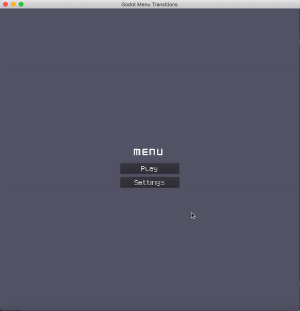

## Godot template with menu transitions

This project was created to demonstrate how to create scene transitions in Godot and also to be used as a starting point for whoever wants to build a game from scratch with screen transitions already included.

This provides a basic fade animation between the scenes + a loading animation when opening the game scene

### Switching transition animations

If you want to use a different animation between the scenes, just change the nextScene and previousScene animations of **SceneManager => AnimationPlayer**